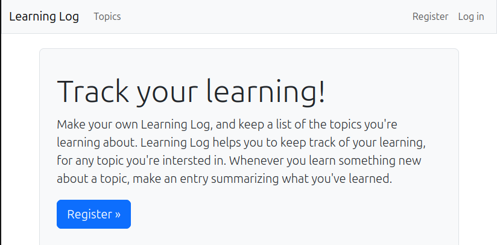
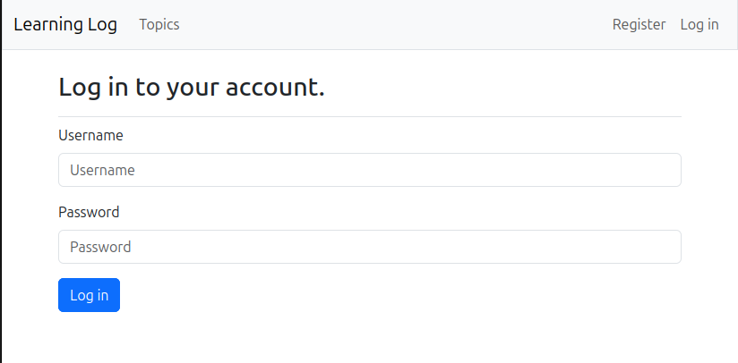
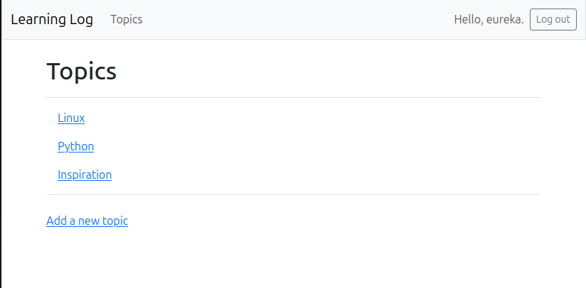
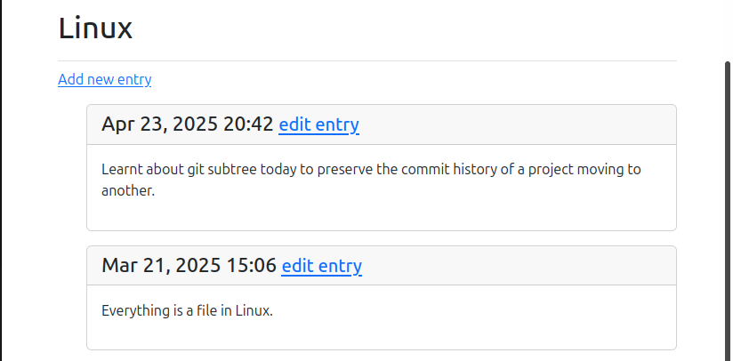

# Learning Log

Learning Log is a web app the allows users to log topics they're are in interested in and make journal entries as they learn about each topic.It help learners to keep notes of their learning. The learning Log home page invites users to either register or log in. Once logged in, a user can create new topics, add new entries, and read and edit existing entries.

When researching a new topic, maintaining a journal of things learned can help to keep track of new information and information you’ve already found. This is especially true when studying technical subjects. A good app, like Learning Log, can help make this process more efficient.

---
## Overview

Here are a few screenshots of the web app

## Setup

You can execute the `setup.sh` script with `bash setup.sh` or `chmod u+x setup.sh` then
`./setup.sh`

